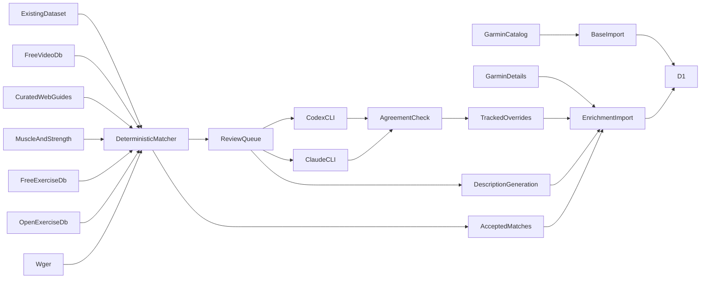

# Exercise enrichment

The gym library combines Garmin exercise identifiers with instructions and movement media from several exercise datasets. Garmin category and exercise keys remain the identity used for search and watch compatibility. Enrichment can change without changing that identity.

## Source order

The importer fills each field from the first available source:

1. Garmin detail JSON provides descriptions, difficulty, hero images, and some videos.
2. `hasaneyldrm/exercises-dataset` provides GIFs and English and Chinese instructions.
3. `harshvishu/free-exercise-db-with-videos` provides English instructions, thumbnails, and HD movement videos.
4. Tracked curated guides cover exact movements found in specialist movement libraries.
5. Muscle & Strength exercise guides provide published instructions, images, and YouTube demonstrations.
6. wger provides aliases, descriptions, images, and some videos.
7. `yuhonas/free-exercise-db` provides English instructions and movement images.
8. `Glowupp-app/open-exercisedb` provides English descriptions and execution tips.
9. Codex writes a fallback description for familiar unmatched movements and Claude independently checks whether the Garmin name is unambiguous.

Garmin details do not require movement matching because the URL contains the Garmin category and exercise key. Other published sources require matching. AI fallback text is labeled in the UI and never supplies media.

## Data flow



## Request controls

Bulk files are fetched once and cached. Wger and the free video database use collection endpoints rather than one request per exercise. Muscle & Strength guide URLs are discovered from public category indexes, then guide pages are cached for 30 days.

Garmin detail pages require fan-out requests. The importer applies these limits:

- Three request starts per second
- Five requests in flight
- Random jitter between starts
- Thirty-second request timeout
- Three attempts for transient failures
- `Retry-After` support
- Host pause after repeated HTTP 403 or 429 responses
- Thirty-day cache for successful details and 404 responses

Every response is written to `scripts/.exercise-enrichment-cache/`. A stopped run can resume without requesting completed records again. Use `--offline` to prevent network requests.

## Matching

Candidate names are normalized before comparison:

- Case and punctuation are removed.
- Garmin underscores and hyphens become spaces.
- Common abbreviations such as `DB`, `KB`, and `BB` become equipment names.
- Simple singular forms and push-up, pull-up, and sit-up variants are normalized.
- Garmin keys, common movement synonyms, and source aliases are included.

The score is primarily name similarity, with smaller contributions from muscles, equipment, body part, and description. An automatic match needs a score of at least 0.90 and a margin of at least 0.08 over the next candidate. Exact ties remain unresolved.

The free HD video source and Muscle & Strength have stricter rules. Their name or an alias must exactly match after normalization, equipment must agree, and known variant conflicts are denied explicitly.

The matcher stores the source ID and confidence. This makes every selected record traceable.

## Codex and Claude CLI review

Unresolved records are written to `scripts/exercise-review-queue.json`. Each queue item contains the Garmin record and the top candidates from every source.

`scripts/review-exercise-matches.mjs` sends batches of 25 records to the locally installed `codex` and `claude` commands. Those commands use their configured remote services. Each command must return structured JSON.

Both commands run in an empty temporary directory. Codex uses a read-only ephemeral sandbox with user rules disabled. Claude starts in safe mode with no tools and no session persistence. Source descriptions are treated as matching data and cannot grant either command access to the repository.

A match is saved only when both services:

- Select the same candidate ID
- Return confidence of at least 0.75
- Select an ID from the supplied candidate list

If both services reject all candidates with at least 0.90 confidence, the record is saved as unmatched. Other disagreements are saved as `needs-manual` and can be reconsidered after source or matching changes.

Decisions are stored in `data/exercise-enrichment/match-overrides.json`. This file is committed so later imports are deterministic and do not repeat completed reviews.

## AI description fallback

Run `npm run exercises:describe:garmin` after enrichment has produced the review queue. Codex and Claude receive only the Garmin name, muscles, equipment, body part, and identifiers. Both must confirm that the movement is unambiguous with at least 0.80 confidence. Codex supplies the text and Claude acts as the independent check.

Accepted text is stored in `data/exercise-enrichment/generated-descriptions.json`. The UI labels it as AI-generated and displays a verification notice. Claude confirms that the movement is identifiable from the metadata; it does not edit the Codex wording. Unclear proprietary or adaptive movements remain unresolved instead of receiving guessed instructions.

The generator supports `--dry-run`, `--max-batches`, and `--filter`. For example:

```bash
npm run exercises:describe:garmin -- --filter lunge --max-batches 2
```

Run the enrichment importer again after generation so the SQL includes accepted descriptions.

## Database fields

Migration `0022_exercise_enrichment.sql` adds:

- `matched_exercise_id`
- `enrichment_sources`
- `match_confidence`
- `instructions_en`
- `instructions_zh`
- `gif_url`
- `video_url`
- `difficulty`
- `enriched_at`

The existing `description` and `image_url` columns hold enriched values. Base Garmin imports use upserts and do not overwrite these fields.

## Local run

```bash
npm run db:migrate:local
npm run exercises:import:garmin
npm run exercises:seed:garmin:local
npm run exercises:enrich:garmin
npm run exercises:review:garmin -- --dry-run
npm run exercises:describe:garmin -- --dry-run
npm run exercises:enrich:garmin
npm run exercises:seed:enrichment:local
```

For a faster first check:

```bash
node scripts/enrich-garmin-exercises.mjs --limit 25
```

Review `scripts/exercise-enrichment-report.json` before seeding. It lists processed records, accepted matches, descriptions, English and Chinese instructions, GIFs, images, videos, unresolved records, and blocked hosts.

## Production run

Run the full import and inspect the report. Apply production changes only when the source counts and match coverage look reasonable:

```bash
npm run db:migrate:remote
npm run exercises:seed:garmin:remote
npm run exercises:seed:enrichment:remote
```

Verify stored coverage:

```sql
SELECT
  COUNT(*) AS total,
  COUNT(description) AS descriptions,
  COUNT(gif_url) AS gifs,
  COUNT(image_url) AS images,
  COUNT(video_url) AS videos,
  COUNT(matched_exercise_id) AS linked
FROM garmin_exercises;
```

The exercise API caches its in-memory index for five minutes. Existing isolates may need that long to show new enrichment.

## Troubleshooting

If Garmin returns repeated 403 or 429 responses, stop and keep the cache. Wait before resuming. Do not increase concurrency.

If the review queue is unexpectedly large, inspect the top candidates in the generated queue before lowering thresholds. Lower thresholds can attach media for a different movement.

If a saved match is wrong, edit or remove its entry in `data/exercise-enrichment/match-overrides.json`, rerun enrichment, and review the generated report.

If a source is unavailable, cached data remains usable. Enrichment SQL uses existing D1 values when the current run has no replacement, so a temporary source failure does not clear stored details.
